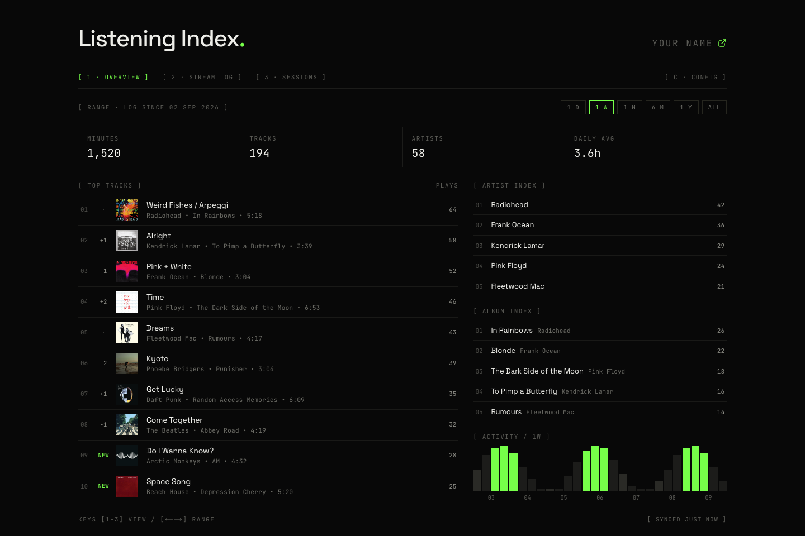
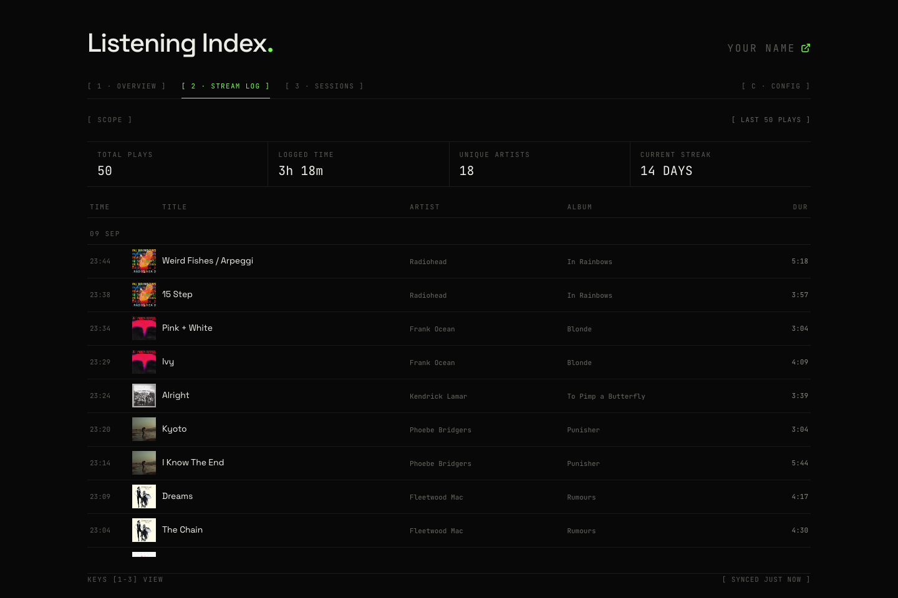
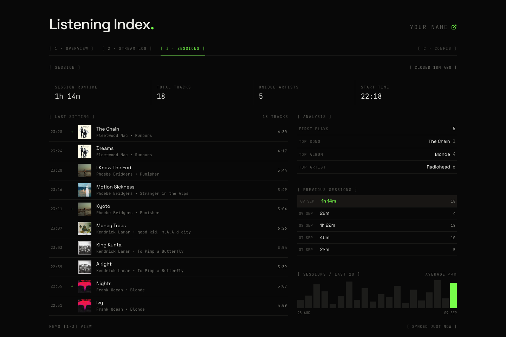
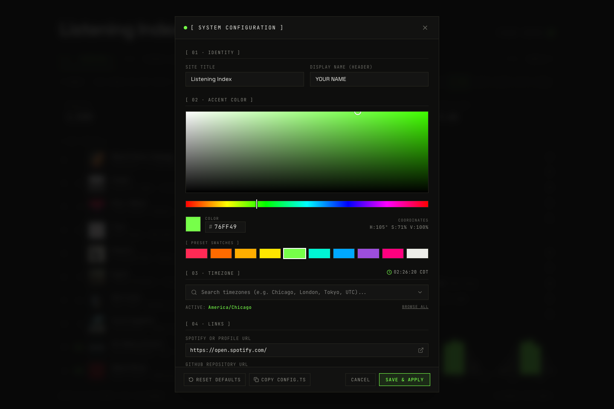

# Listening Index

A high-contrast, minimalist Spotify streaming aggregator and index.

Designed for music enthusiasts, developers, and data hoarders who want a permanent, self-hosted record of their Spotify streaming history.

[](https://nextjs.org/)
[](https://tailwindcss.com/)
[](https://neon.tech/)

---

## Table of Contents

- [Features](#features)
- [Demo & Screenshots](#demo--screenshots)
- [Prerequisites](#prerequisites)
- [Quickstart: Deploy to Vercel (Recommended)](#quickstart-deploy-to-vercel-recommended)
  - [Step 1: 1-Click Deploy](#step-1-1-click-deploy)
  - [Step 2: Connect Neon Database](#step-2-connect-neon-database)
  - [Step 3: Get Spotify API Credentials](#step-3-get-spotify-api-credentials)
  - [Step 4: Get Your Spotify Refresh Token](#step-4-get-your-spotify-refresh-token)
  - [Step 5: Set Up Scheduled Sync (cron-job.org)](#step-5-set-up-scheduled-sync-cron-joborg)
  - [Step 6: Trigger Initial Sync & Verify](#step-6-trigger-initial-sync--verify)
- [Local Development](#local-development)
- [Customization](#customization)
- [Keyboard Shortcuts](#keyboard-shortcuts)
- [Environment Variables Reference](#environment-variables-reference)
- [CLI Utilities](#cli-utilities)
- [Architecture & Tech Stack](#architecture--tech-stack)
- [License](#license)

---

## Features

- **3 Dedicated Modes**:
  - **Overview**: 24-hour / weekly / all-time metrics, rank drift (`+1`, `-2`, `NEW`), top tracks, albums, artists, and an activity cadence histogram.
  - **Stream Log**: Chronological stream ledger tracking every track played with playback gaps and sitting markers.
  - **Current Session**: Real-time sitting detection, first-play markers, session duration, and album distribution.
- **Zero-Config Demo Mode**: Clone the repo and run `npm run dev`—the entire UI immediately renders on rich fixture data without needing database or API keys.
- **In-App & Code Customization**: Real-time interactive color picker, timezone selector, and instant config generation (`[ C · CONFIG ]` or press `C`).
- **Self-Healing Database**: No manual migrations or SQL console tabs required. Tables and indexes auto-bootstrap on the first sync.
- **Automated Sync**: Cron-friendly sync endpoint (`/api/sync`) with idempotency and deduplication for continuous ingestion.

---

## Demo & Screenshots

Explore the [Live Demo](https://listening-index.vercel.app/), my [personal site](https://blairqiao.com), or [run it locally](#local-development) to test all features:

### 1. Overview Mode
*All-time and range metrics (listening minutes, track counts, daily cadence), rank drift indicators (`+1`, `-2`, `NEW`), top tracks with album covers, top artists, and activity histograms across 6 time ranges (1D, 1W, 1M, 6M, 1Y, ALL).*



### 2. Stream Log Mode
*Chronological playback ledger documenting every song streamed, precise timestamps, play duration, album releases, and continuous listening streaks.*



### 3. Sessions Mode
*Intelligent listening session aggregator clustering continuous playbacks, calculating first-play milestones, session durations, and 20-session history cadences.*



### 4. In-App Customization Modal
*Interactive GUI to dynamically adjust your accent color, identity, timezone, and links with instant live preview and 1-click `config.ts` code export.*



---

## Prerequisites

Before deploying, make sure you have:
- A **Spotify Account** (Requires Premium)
- A free **[GitHub](https://github.com)** account (to host your repository fork)
- A free **[Vercel](https://vercel.com)** account (to host your web application)
- A free **[cron-job.org](https://cron-job.org)** account (to schedule automated syncing)

---

## Quickstart: Deploy to Vercel (Recommended)

Deploy your personal Listening Index in under 5 minutes without having to manage servers.

### Step 1: 1-Click Deploy
Click the button below. Vercel will prompt you to clone the repository to your personal GitHub account and create the project:

[](https://vercel.com/new/clone?repository-url=https%3A%2F%2Fgithub.com%2FBlairqiao%2Flistening_index&env=SPOTIFY_CLIENT_ID,SPOTIFY_CLIENT_SECRET,SPOTIFY_REFRESH_TOKEN,CRON_SECRET&envDefaults=%7B%22SPOTIFY_CLIENT_ID%22%3A%22todo%22%2C%22SPOTIFY_CLIENT_SECRET%22%3A%22todo%22%2C%22SPOTIFY_REFRESH_TOKEN%22%3A%22todo%22%2C%22CRON_SECRET%22%3A%22todo%22%7D&envDescription=Credentials%20for%20Spotify%20API%20and%20Database&project-name=listening-index)

> 💡 **Tip for your initial deploy:** All environment variables are automatically pre-filled with `"todo"`. Simply click **Deploy** without editing anything! The application will immediately build and deploy into **Demo Mode** with sample data. You can then connect your real database and Spotify credentials in Steps 2–5.

---

### Step 2: Connect Neon Database
1. On your Vercel Project Dashboard, navigate to the **Storage** tab.
2. Select **Connect Database → Neon Postgres**.
3. Vercel will automatically provision the database and configure the `DATABASE_URL` environment variable.
4. *No tables need to be created manually* - the application self-heals and bootstraps all tables and indexes on its first sync.

---

### Step 3: Get Spotify API Credentials
1. Go to the [Spotify Developer Dashboard](https://developer.spotify.com/dashboard) and log in.
2. Click **Create App**:
   - **App Name**: `Listening Index` (or your choice)
   - **App Description**: `Personal music tracking dashboard`
   - **Redirect URIs**: Enter `http://127.0.0.1:8888/callback`
   - Which API/SDKs are you planning to use? Select **Web API**.
   - Check the terms agreement and click **Save**.
3. Once created, click **Settings** to find your:
   - **Client ID** (`SPOTIFY_CLIENT_ID`)
   - **Client Secret** (`SPOTIFY_CLIENT_SECRET`)

---

### Step 4: Get Your Spotify Refresh Token

Choose whichever method you prefer:

#### Option A: Automated OAuth Helper (Fastest — Requires Cloning Repo)
If you have Node.js installed on your computer, clone your repository fork and run the interactive helper:

```bash
npm install
npm run auth:spotify
```
The script will prompt for your Client ID & Secret, open Spotify in your default browser for one-click authorization, capture the callback on `http://127.0.0.1:8888/callback`, and display your `SPOTIFY_REFRESH_TOKEN`.

Now add these three variables in **Vercel Project Dashboard → Settings → Environment Variables**:
- `SPOTIFY_CLIENT_ID`
- `SPOTIFY_CLIENT_SECRET`
- `SPOTIFY_REFRESH_TOKEN`

#### Option B: Manual In-Browser / cURL
If you don't have Node.js or prefer not to clone the repository to your computer, you can complete the OAuth exchange manually using your browser and `curl`:
1. Paste this URL into your browser (replace `YOUR_CLIENT_ID` with your Spotify Client ID):
   ```text
   https://accounts.spotify.com/authorize?client_id=YOUR_CLIENT_ID&response_type=code&redirect_uri=http%3A%2F%2F127.0.0.1%3A8888%2Fcallback&scope=user-read-recently-played%20user-read-playback-state%20user-read-currently-playing
   ```
2. Click **Agree**. Your browser will redirect to a page starting with:
   `http://127.0.0.1:8888/callback?code=NApA...`
3. Copy the `code` parameter value from your browser's address bar. (Everything after `?code=`)
4. Run this `curl` command in your terminal to exchange the code for your refresh token:
   ```bash
   curl -X POST https://accounts.spotify.com/api/token \
     -H "Content-Type: application/x-www-form-urlencoded" \
     -u "YOUR_CLIENT_ID:YOUR_CLIENT_SECRET" \
     --data-urlencode "grant_type=authorization_code" \
     --data-urlencode "code=YOUR_COPIED_CODE" \
     --data-urlencode "redirect_uri=http://127.0.0.1:8888/callback"
   ```
5. Copy the `"refresh_token"` string from the JSON response:
   ```json
   "access_token": "NgA6...",
   "token_type": "Bearer",
   "expires_in": 3600,
   "refresh_token": "AQBQ...", <--- THIS ONE
   "scope": "user-read-recently-played user-read-playback-state user-read-currently-playing"
   ```
6. Add `SPOTIFY_CLIENT_ID`, `SPOTIFY_CLIENT_SECRET`, and `SPOTIFY_REFRESH_TOKEN` to your Vercel Environment Variables.

---

### Step 5: Set Up Scheduled Sync

Because Spotify's API only retains your **last 50 played tracks**, syncing regularly ensures you never miss a song even during heavy listening sessions.

1. **Create a `CRON_SECRET`**: This is a private passphrase that protects your sync endpoint so only your cron job can trigger ingestion. [Generate any secure random string](https://generate-secret.vercel.app/32), or run on your local instance:
   ```bash
   npm run generate:cron
   ```
2. Add `CRON_SECRET` to your **Vercel Project Dashboard → Settings → Environment Variables**.
3. Create a free account at [cron-job.org](https://cron-job.org).
4. Click **Create Cronjob**:
   - **Title**: `Listening Index Sync`
   - **URL**: `https://<your-app>.vercel.app/api/sync?key=YOUR_CRON_SECRET`
   - **Schedule**: Every 30 minutes
   - **Request Method**: `GET`
5. Save the job. Your listening history is now synced continuously in the background!

---

### Step 6: Trigger Initial Sync & Verify

Once your environment variables are configured in Vercel, redeploy your project (or trigger a sync manually) to ingest your first batch of streams:

1. In your browser, open:
   ```text
   https://<your-app>.vercel.app/api/sync?key=YOUR_CRON_SECRET
   ```
2. You will receive a JSON response confirming successful ingestion:
   ```json
   {
     "success": true,
     "processed": 50,
     "durationMs": 842,
     "syncedAt": "2026-09-09T20:30:00.000Z"
   }
   ```
3. Refresh your site homepage (`https://<your-app>.vercel.app`). Your live Spotify history, overview stats, and stream log are now fully operational!

---

## Local Development

You can also run the project locally:

```bash
# 1. Clone repository
git clone https://github.com/Blairqiao/listening-index.git
cd listening-index

# 2. Install dependencies
npm install

# 3. Run development server
npm run dev
```

Open [http://localhost:3000](http://localhost:3000). The site will automatically load in **Demo Mode** using built-in mock listening data.

### Connecting Real Spotify Data Locally

#### 1. Set Up a Free Neon Database
1. Go to **[neon.tech](https://neon.tech)** and sign in (free tier gives you a serverless PostgreSQL instance).
2. Click **Create Project** (name it `listening-index` or your choice).
3. On your project dashboard, find **Connection Details** and copy the connection string. It looks like:
   ```text
   postgresql://[user]:[password]@[endpoint].neon.tech/neondb?sslmode=require
   ```
4. Add it to your `.env.local` file:
   ```bash
   echo 'DATABASE_URL="postgresql://[user]:[password]@[endpoint].neon.tech/neondb?sslmode=require"' >> .env.local
   ```
   *(No tables or migrations need to be created manually — the schema self-heals and auto-bootstraps on your first sync!)*

#### 2. Configure Credentials & Ingest Data
The built-in CLI tools will automatically configure your remaining `.env.local` variables:

```bash
# 1. Authorize Spotify (automatically adds Client ID, Secret, and Refresh Token to .env.local)
npm run auth:spotify

# 2. Generate a secure cron secret (automatically appends CRON_SECRET to .env.local)
npm run generate:cron

# 3. Ingest your latest 50 tracks into your Neon database
npm run sync

# 4. Start the dev server with your live Spotify data
npm run dev
```

---

## Customization

Listening Index uses both a local config file `src/config.ts` and a remote db `site_settings` to store config.

### Active Configuration (Neon PostgreSQL)

- Stored in the `site_settings` database table
- Can be edited via the in-app GUI
- Saved to the cloud and reflected for all visitors

### Default Configuration (`src/config.ts`)

- Provides defaults when no database is connected
- Re-synced whenever you click [RESET DEFAULTS] in the GUI
- Can be edited directly in the file


### 1. In-App Customizer (Active Config)
Press <kbd>C</kbd> anywhere on the dashboard (or click the **`[ C · CONFIG ]`** tab in the top navigation) to launch the configuration modal:
- **Identity & Profiles**: Edit your display title, owner name, Spotify profile link, and GitHub repository URL.
- **Interactive 2D Color Picker**: Visually pick your accent color. The entire UI recolors live.
- **Searchable Timezone Selector**: Choose from 30+ world timezones with a real-time local clock preview.
- **Saving & Persistence**:
  - **On Vercel (with Neon connected)**: Clicking **`Save & Apply`** saves your settings directly into your Neon PostgreSQL database.
  - **In Local Development**: Saves to both your Neon database and [`src/config.ts`](src/config.ts).
  - **In Demo Mode**: Saves to browser cache (`localStorage`).
- **Reset to Defaults**: Click **`[RESET DEFAULTS]`** at any time to discard database customizations and restore the default values from [`src/config.ts`](src/config.ts).

### 2. Static Default Configuration (`src/config.ts`)
[`src/config.ts`](src/config.ts) defines the factory defaults used when the database is empty or offline:

```typescript
export const siteConfig = {
  title: "Listening Index",                                        // Header brand title
  ownerName: "YOUR NAME",                                          // Display name shown in top-right
  accentColor: "#76ff49ff",                                        // Default accent color
  siteUrl: "https://open.spotify.com/",                           // Top-right profile destination
  githubUrl: "https://github.com/Blairqiao/listening_index",       // Header title destination
  timezone: "America/Chicago",                                     // Default timezone for daily cadence
};
```

> 💡 **Tip:** If you clone the repository or change `src/config.ts` in your code editor, clicking **`[RESET DEFAULTS]`** in the in-app modal will instantly push your updated `src/config.ts` settings into your Neon database.

---

## Keyboard Shortcuts

The dashboard is engineered for high-efficiency terminal-style keyboard navigation:

| Key | Action |
| :--- | :--- |
| <kbd>1</kbd> | Switch to **Overview** |
| <kbd>2</kbd> | Switch to **Stream Log** |
| <kbd>3</kbd> | Switch to **Sessions** |
| <kbd>←</kbd> / <kbd>→</kbd> | Cycle time ranges (`1D` → `1W` → `1M` → `6M` → `1Y` → `ALL`) |
| <kbd>S</kbd> | Toggle session state (active vs closed) |
| <kbd>C</kbd> | Toggle **Configuration & Customization Modal** |
| <kbd>Esc</kbd> | Close configuration modal |

---

## Environment Variables Reference

| Variable | Description | Required? | Where to find |
| :--- | :--- | :--- | :--- |
| `DATABASE_URL` | PostgreSQL connection string with SSL | **Yes** | Neon dashboard or Vercel Storage integration |
| `SPOTIFY_CLIENT_ID` | Spotify developer application client ID | **Yes** | [Spotify Developer Dashboard](https://developer.spotify.com/dashboard) |
| `SPOTIFY_CLIENT_SECRET` | Spotify developer application client secret | **Yes** | Spotify Developer Dashboard |
| `SPOTIFY_REFRESH_TOKEN` | OAuth 2.0 refresh token with playback read scopes | **Yes** | Generated via `npm run auth:spotify` or manual curl |
| `CRON_SECRET` | Secret token to authorize ingestion pings | **Yes** | Any random secret (or `npm run generate:cron`) |

---

## CLI Utilities

This project includes built-in scripts to streamline maintenance:

| Command | Action |
| :--- | :--- |
| `npm run dev` | Starts local Next.js dev server on `http://localhost:3000` |
| `npm run build` | Builds optimized production bundle with type checks |
| `npm run auth:spotify` | Interactive OAuth helper to acquire `SPOTIFY_REFRESH_TOKEN` and save to `.env.local` |
| `npm run generate:cron` | Generates a secure `CRON_SECRET` and saves to `.env.local` |
| `npm run sync` | Manually runs the Spotify ingestion ETL pipeline |

---

## Architecture & Tech Stack

- **Framework**: [Next.js 16](https://nextjs.org/) (App Router, Server Components)
- **Database**: [Neon](https://neon.tech/) Serverless PostgreSQL via `@neondatabase/serverless`
- **Styling**: [Tailwind CSS v4](https://tailwindcss.com/) with CSS variables
- **Typography**: [Space Grotesk](https://fonts.google.com/specimen/Space+Grotesk), [JetBrains Mono](https://fonts.google.com/specimen/JetBrains+Mono), [Noto Sans SC](https://fonts.google.com/specimen/Noto+Sans+SC)
- **Icons**: [Lucide React](https://lucide.dev/)
- **API**: Spotify Web API (`/v1/me/player/recently-played`)

---

## License

MIT License. Feel free to fork, customize, and self-host your own listening index!
