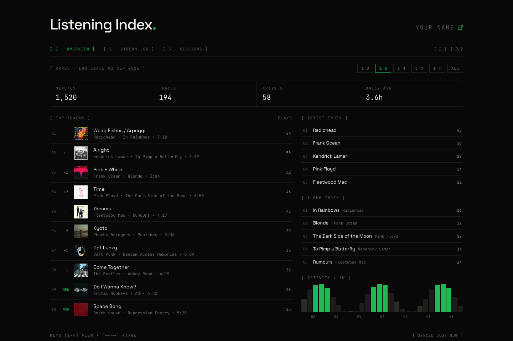
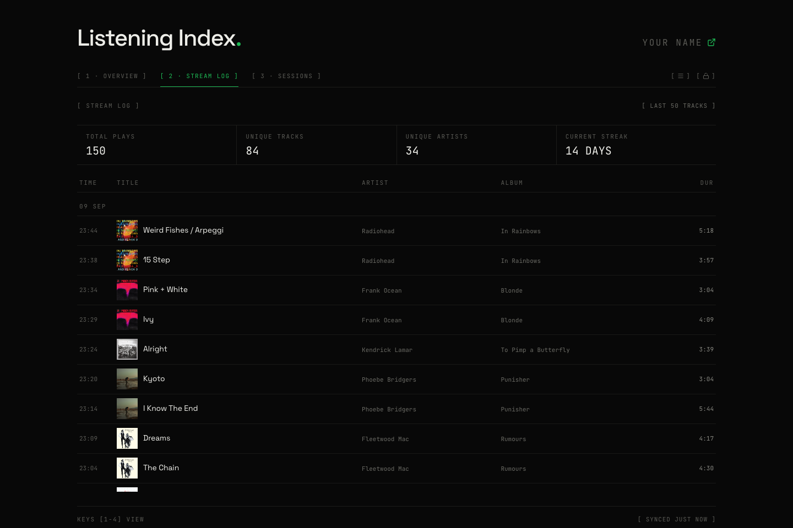
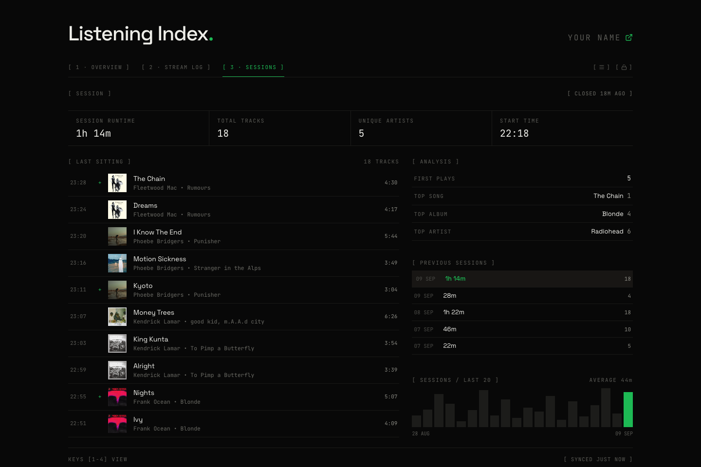
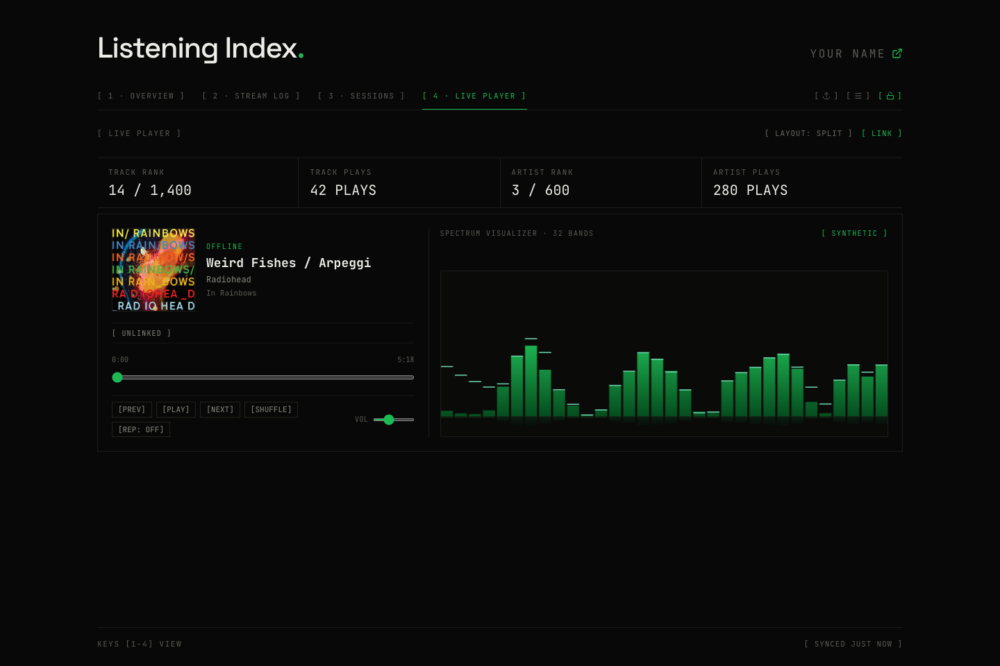
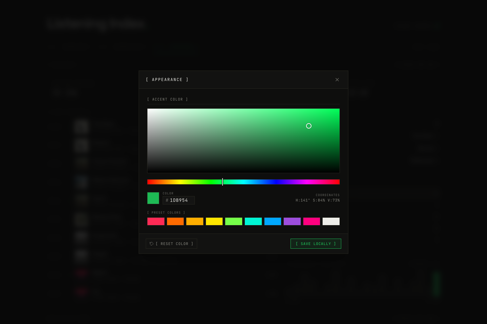
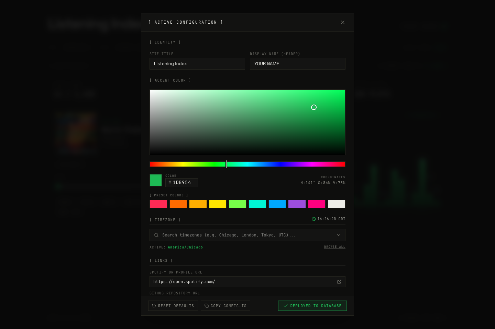
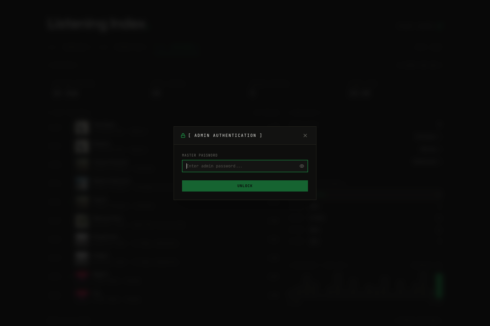
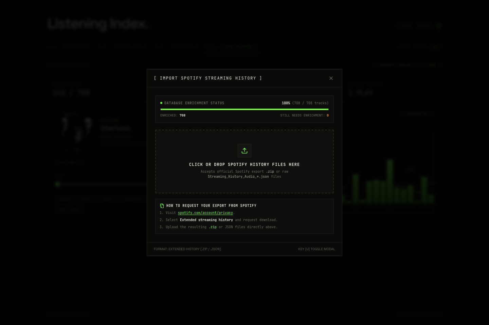

# Listening Index

A personal Spotify dashboard that tracks and stores your streaming history.

[](https://nextjs.org/)
[](https://tailwindcss.com/)
[](https://neon.tech/)

---

## Demo and screenshots

See the [live demo](https://listening-index.vercel.app/) or [run it locally](#local-development) with sample data.

### Overview

Shows listening time, track count, daily averages, rank changes, top tracks and artists, and a listening activity graph across six time ranges.



### Stream log

A chronological list of every track played with timestamps, track lengths, album names, and current day streak.



### Sessions

Groups continuous listening into sessions, marks first-time plays, and tracks session lengths over time.



### Live player

Controls Spotify playback with a 32-band frequency visualizer, split console and stacked stage layouts, and device switching. Shows total plays and archive rank for the current track and artist.

Unlocked with `ADMIN_PASSWORD` via the dedicated admin login modal (`[ <Lock /> ]` button or `L` key). Public visitors only see modes 1–3.



### Appearance & configuration

Listening Index decouples visitor personalization from administrative configuration:

- **Visitor Appearance**: Guests can customize their accent color locally in their browser with zero database calls or write permissions.
- **Admin Configuration**: Unlocking admin access allows configuring site title, owner name, timezone, external links, and deploying settings permanently to the database.

| Visitor Appearance (`[ APPEARANCE ]`) | Admin Configuration (`[ ACTIVE CONFIGURATION ]`) |
| :---: | :---: |
|  |  |

### Admin authentication & history upload

| Dedicated Admin Login (`L` key) | Direct History Import (`U` key) |
| :---: | :---: |
|  |  |

---

## Prerequisites

- A Spotify Premium account (Spotify requires Premium to create apps in its developer dashboard)
- A free GitHub account
- A free Vercel account
- A free [Neon](https://neon.tech) account (optional if connecting through Vercel)
- A free cron-job.org account
- Node.js 20+ (for local development)

---

## Deploy to Vercel

### Step 1: Fork and import the repository

1. Click **Fork** at the top right of this repository to create a copy under your GitHub account.
2. Go to [vercel.com/new](https://vercel.com/new).
3. Select your forked `listening_index` repository and click **Import**.
4. Click **Deploy**. The site deploys in demo mode with sample data. You will connect your database and credentials in the next steps.

---

### Step 2: Connect Neon database

1. In your Vercel project dashboard, open the **Storage** tab.
2. Click **Connect Database** and select **Neon Postgres**.
3. Vercel provisions the database and sets `DATABASE_URL` automatically.
4. You do not need to create tables manually. The app creates the schema on its first sync.

---

### Step 3: Get Spotify API credentials

1. Open the [Spotify Developer Dashboard](https://developer.spotify.com/dashboard) and log in.
2. Click **Create App**:
   - App name: `Listening Index`
   - App description: `Personal music tracking dashboard`
   - Redirect URIs: `http://127.0.0.1:8888/callback` and `https://<your-app>.vercel.app/callback`
   - Select **Web API** and **Web Playback SDK**
3. Save the app, open **Settings**, and copy:
   - Client ID (`SPOTIFY_CLIENT_ID`)
   - Client Secret (`SPOTIFY_CLIENT_SECRET`)

Spotify redirects back to `http://127.0.0.1:8888/callback` during the login step so the local script can capture your auth code. In production, the Live Player authenticates via `https://<your-app>.vercel.app/callback`.

---

### Step 4: Get your Spotify refresh token

Choose one of two options:

#### Option A: Terminal script (Fastest)

Clone your fork and run:

```bash
npm install
npm run auth:spotify
```

The script asks for your Client ID and Secret, opens Spotify in your browser, and prints your `SPOTIFY_REFRESH_TOKEN`.

Add these three values in **Vercel Project Dashboard -> Project -> Environment Variables**:
- `SPOTIFY_CLIENT_ID`
- `SPOTIFY_CLIENT_SECRET`
- `SPOTIFY_REFRESH_TOKEN`

#### Option B: In-browser curl (No clone needed)

1. Open this URL in your browser, replacing `YOUR_CLIENT_ID`:
   ```text
   https://accounts.spotify.com/authorize?client_id=YOUR_CLIENT_ID&response_type=code&redirect_uri=http%3A%2F%2F127.0.0.1%3A8888%2Fcallback&scope=user-read-recently-played%20user-read-playback-state%20user-read-currently-playing
   ```
2. Click **Agree**. The browser redirects to a page starting with `http://127.0.0.1:8888/callback?code=...`.
3. Copy the code from the address bar after `?code=`.
4. Run this curl command:
   ```bash
   curl -X POST https://accounts.spotify.com/api/token \
     -H "Content-Type: application/x-www-form-urlencoded" \
     -u "YOUR_CLIENT_ID:YOUR_CLIENT_SECRET" \
     --data-urlencode "grant_type=authorization_code" \
     --data-urlencode "code=YOUR_COPIED_CODE" \
     --data-urlencode "redirect_uri=http://127.0.0.1:8888/callback"
   ```
5. Copy the `"refresh_token"` string from the JSON response and add all three variables to Vercel.

---

### Step 5: Set up scheduled sync

Spotify only keeps your last 50 played tracks, so a regular sync keeps your history complete.

1. Generate a secret key to protect the sync endpoint. Use [generate-secret.vercel.app/32](https://generate-secret.vercel.app/32) or run `npm run generate:cron`.
2. Add `CRON_SECRET` to your Vercel environment variables.
3. In [cron-job.org](https://cron-job.org), create a job:
   - Title: `Listening Index Sync`
   - URL: `https://<your-app>.vercel.app/api/sync?key=YOUR_CRON_SECRET`
   - Schedule: Every 30 minutes
4. Save the job.

---

### Step 6: Configure Admin Password

Your Listening Index is designed to be public so friends and visitors can browse your music stats. To prevent unauthorized visitors from modifying your site or database, and to protect your personal playback controls, configure an administrative password:

1. In your Vercel project dashboard, go to **Settings -> Environment Variables**.
2. Add a new variable:
   - **Name**: `ADMIN_PASSWORD`
   - **Value**: Any strong, secure passphrase of your choice
3. What this protects:
   - **Dedicated Admin Authentication (`L` key / `[ <Lock /> ]` button)**: Click the lock icon in the navigation bar or press `L` to open the Admin Authentication modal. Entering your `ADMIN_PASSWORD` elevates the session; clicking the unlocked icon `[ <Unlock /> ]` or pressing `L` again instantly logs out.
   - **Live Player (`4` key / `[ 4 · LIVE PLAYER ]` tab)**: Appears in navigation upon login. Unlocks the full in-browser Spotify Web Playback SDK player, live frequency spectrum visualizer, and personal archive telemetry. Public visitors only see modes 1–3 (Overview, Stream Log, and Sessions).
   - **Extended History Ingestion (`U` key / `[ <Upload /> ]` button)**: Upload icon appears in navigation upon login. Unlocks direct drag-and-drop ingestion of Spotify extended streaming history archives into your database.
   - **Full Configuration & Database Deployment (`C` key / `[ <Menu /> ]` button)**: Elevates the appearance menu into the full configuration modal with options to update site title, timezone, links, and click **Deploy to Database** (`/api/config`).
   - **Manual Sync**: Allows triggering instant Spotify synchronizations directly from the web interface.

---

### Step 7: Run your first sync

#### IMPORTANT: Make sure all [environment variables](#environment-variables) (`DATABASE_URL`, `SPOTIFY_CLIENT_ID`, `SPOTIFY_CLIENT_SECRET`, `SPOTIFY_REFRESH_TOKEN`, `CRON_SECRET`, and `ADMIN_PASSWORD`) are present in Vercel and redeployed. Go to the [Vercel dashboard](https://vercel.com/dashboard) and verify your environment variables before testing.

1. Open `https://<your-app>.vercel.app/api/sync?key=YOUR_CRON_SECRET` in your browser.
2. The endpoint returns a JSON confirmation when complete:
   ```json
   { "success": true, "processed": 50 }
   ```
3. Open your homepage. Your live Spotify data will appear.

---

### Step 8: Import your extended listening history (Optional)

To backfill your entire Spotify listening history:

1. Request your **Extended streaming history** from the [Spotify Privacy Settings](https://www.spotify.com/account/privacy/) page (takes a few days to prepare).
2. Log in as admin by pressing `L` or clicking the lock icon `[ <Lock /> ]` in the top navigation bar.
3. Once authenticated, press `U` or click the upload icon `[ <Upload /> ]` in the top navigation bar.
4. Drag and drop the downloaded `.zip` file (or individual `endsong_*.json` files).
5. The client extracts audio plays directly in your browser, streams them to your database, and begins progressive metadata enrichment.

---

### Keeping your fork updated

When updates or fixes are published to the main repository:

1. Open your fork on GitHub.
2. Click **Sync fork**, then click **Update branch**.
3. Vercel automatically deploys the new commits.

---

## Local development

Run the site locally with mock data:

```bash
git clone https://github.com/Blairqiao/listening-index.git
cd listening-index
npm install
npm run dev
```

Open `http://localhost:3000`.

### Connect real data locally

1. Copy your database connection string (`DATABASE_URL`) from the **Storage** tab in your Vercel dashboard, or from the [Neon Console](https://console.neon.tech).
2. Create `.env.local` from the template `.env.example`
3. Run the setup scripts to authorize Spotify and generate your cron key:
   ```bash
   npm run auth:spotify
   npm run generate:cron
   npm run sync
   npm run dev
   ```

---

## Customization

Listening Index features a decoupled customization architecture separating visitor appearance from administrative configuration:

### For visitors (Appearance)
Press `C` or click the menu icon `[ <Menu /> ]` in the top navigation:
- Select an accent color using the color picker or preset swatches. The page repaints in real time.
- Click **[ SAVE LOCALLY ]** to store your choice in browser `localStorage`. No database calls or admin passwords are required.
- Click **[ RESET COLOR ]** to restore the default accent color.

### For administrators (Active configuration)
Log in via `L` or `[ <Lock /> ]`, then press `C` or click `[ <Menu /> ]`:
- Update your display title, owner name, Spotify link, and GitHub repository link.
- Select your timezone from the searchable IANA list to match your daily activity graph.
- Click **[ DEPLOY TO DATABASE ]** to save configuration permanently to Neon so all visitors see your customized settings.
- Click **[ RESET DEFAULTS ]** to restore values from `src/config.ts`, or click **[ COPY CONFIG.TS ]** to export your active settings as static TypeScript code.

To set permanent defaults in code, edit `src/config.ts`:

```typescript
export const siteConfig = {
  title: "Listening Index",
  ownerName: "YOUR NAME",
  accentColor: "#76ff49ff",
  siteUrl: "https://open.spotify.com/",
  githubUrl: "https://github.com/Blairqiao/listening_index",
  timezone: "America/Chicago",
};
```

---

## Keyboard shortcuts

| Key | Action | Availability |
| :--- | :--- | :--- |
| `1` | Switch to overview | All visitors |
| `2` | Switch to stream log | All visitors |
| `3` | Switch to sessions | All visitors |
| `4` | Switch to live player | Admin only |
| `←` / `→` | Change time range | All visitors |
| `C` | Open appearance / configuration modal | All visitors |
| `U` | Open upload history modal | Admin only |
| `L` | Admin login / lock session | All visitors |
| `Esc` | Close modal | All visitors |

---

## Environment variables

| Variable | Description | Where to find |
| :--- | :--- | :--- |
| `DATABASE_URL` | Neon PostgreSQL connection string (`POSTGRES_URL` also accepted) | Neon dashboard or Vercel Storage tab |
| `ADMIN_PASSWORD` | Secret passphrase to authorize administrative actions (saving config to Neon DB, uploading extended history, manual sync from UI) | Set your own secure passphrase |
| `SPOTIFY_CLIENT_ID` | Spotify app client ID | Spotify Developer Dashboard |
| `SPOTIFY_CLIENT_SECRET` | Spotify app client secret | Spotify Developer Dashboard |
| `SPOTIFY_REFRESH_TOKEN` | OAuth refresh token for user account | Generated via `npm run auth:spotify` or curl flow |
| `CRON_SECRET` | Secret token securing `/api/sync` against unauthorized triggers | Generated via `npm run generate:cron` or online generator |

---

## Scripts

| Command | Action |
| :--- | :--- |
| `npm run dev` | Start development server on `localhost:3000` |
| `npm run build` | Build production Next.js application |
| `npm run start` | Start production Next.js server locally |
| `npm run auth:spotify` | Interactive CLI to authorize Spotify and save refresh token to `.env.local` |
| `npm run generate:cron` | Generate a secure `CRON_SECRET` and save to `.env.local` |
| `npm run sync` | Fetch recent tracks from Spotify and write to database (`sync:spotify` alias) |
| `npm run test:rate-limit` | Test Spotify Web API rate limits against batch queries |

---

## Tech stack

- [Next.js 16](https://nextjs.org/)
- [Neon](https://neon.tech/) Serverless PostgreSQL
- [Tailwind CSS v4](https://tailwindcss.com/)
- Spotify Web API & Spotify Web Playback SDK

---

## License

MIT
