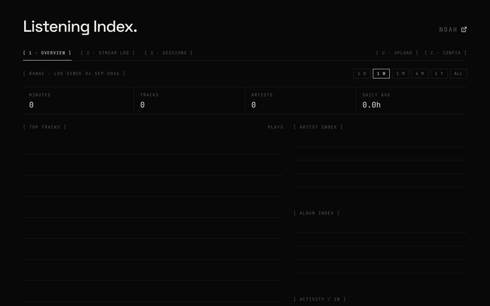
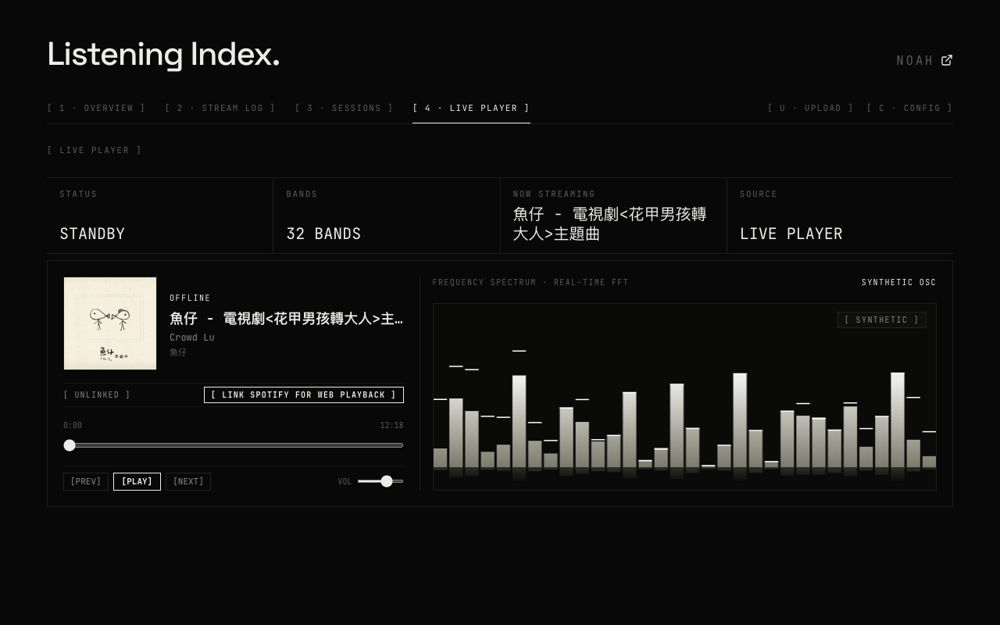
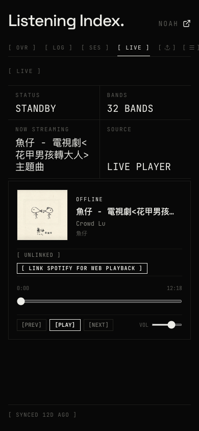

# Unified Live Player & Single-User Architecture Proof

*2026-09-30T07:37:16Z by Showboat 0.6.1*
<!-- showboat-id: ac442d0d-74d8-4b69-bf5a-251df30f8cb8 -->

Production Next.js build and TypeScript compilation verification:

```bash
npm run build | sed -E 's/took [0-9]+m?s/took ...ms/g; s/in [0-9]+m?s/in ...ms/g; s/in [0-9.]+s/in ...s/g; s/tip: .*/tip/g'
```

```output

> listening_index@0.1.0 build
> next build

▲ Next.js 16.3.4 (Turbopack)
- Environments: .env.local
✓ Running next.config.ts took ...ms

  Creating an optimized production build ...
✓ Compiled successfully in ...ms
  Running TypeScript ...
  Finished TypeScript in ...ms ...
  Collecting page data using 17 workers ...
◇ injected env (0) from .env // tip
◇ injected env (0) from .env.local // tip
◇ injected env (0) from spotify.env // tip
  Generating static pages using 17 workers (0/1) ...
✓ Generating static pages using 17 workers (1/1) in ...ms
  Finalizing page optimization ...

Route (app)
┌ ƒ /
├ ƒ /_not-found
├ ƒ /api/auth/login
├ ƒ /api/auth/logout
├ ƒ /api/auth/status
├ ƒ /api/config
├ ƒ /api/listening/overview
├ ƒ /api/listening/session
├ ƒ /api/listening/stream-log
├ ƒ /api/now-playing
├ ƒ /api/owner/spotify
├ ƒ /api/owner/spotify/callback
├ ƒ /api/owner/spotify/login
├ ƒ /api/player/token
├ ƒ /api/sync
├ ƒ /api/upload/enrich
├ ƒ /api/upload/history
└ ƒ /callback


ƒ  (Dynamic)  server-rendered on demand

```

Mode tab gating and permission boundary test suite:

```bash
npx tsx test/test-tab-gating.test.ts | sed -E 's/\([0-9.]+m?s\)/(...ms)/g; s/duration_ms [0-9.]+/duration_ms .../g; s/tip: .*/tip/g'
```

```output
✔ ModeTabs - unauthenticated mode list contains only modes 0, 1, 2 (...ms)
✔ ModeTabs - authenticated mode list contains all 4 modes (0, 1, 2, 3) (...ms)
✔ ListeningView - mode selection boundary clamps mode 3 to 0 when unauthenticated (...ms)
✔ ListeningView - keyboard shortcuts restrict key '4' when unauthenticated (...ms)
✔ ModeTabs & ListeningView - source architecture verification (...ms)
ℹ tests 5
ℹ suites 0
ℹ pass 5
ℹ fail 0
ℹ cancelled 0
ℹ skipped 0
ℹ todo 0
ℹ duration_ms ...
```

Player token API (/api/player/token) route test suite:

```bash
npx tsx test/test-player-token-api.ts | sed -E 's/\([0-9.]+m?s\)/(...ms)/g; s/duration_ms [0-9.]+/duration_ms .../g; s/tip: .*/tip/g'
```

```output
◇ injected env (6) from .env.local // tip
▶ Player Token API - /api/player/token
  ✔ Unauthorized requests return 401 (...ms)
  ✔ Authenticated GET when no token is linked returns { linked: false } (...ms)
  ✔ Authenticated POST with code & redirectUri exchanges code and saves refresh token (...ms)
  ✔ Authenticated GET when token is linked refreshes access token (...ms)
  ✔ Authenticated POST with refreshToken saves token and refreshes access token (...ms)
  ✔ POST with invalid refreshToken does NOT persist to database and returns error (...ms)
  ✔ POST with code exchange missing refresh_token returns 400 and does NOT persist (...ms)
  ✔ POST with code and codeVerifier forwards code_verifier to Spotify (PKCE) (...ms)
  ✔ Authenticated requests via Authorization: Bearer header work (...ms)
  ✔ Authenticated DELETE unlinks player token (...ms)
✔ Player Token API - /api/player/token (...ms)
ℹ tests 11
ℹ suites 0
ℹ pass 11
ℹ fail 0
ℹ cancelled 0
ℹ skipped 0
ℹ todo 0
ℹ duration_ms ...
```

Database schema and system integrity verification suite:

```bash
npx tsx test/verify-integrity.ts | sed -E 's/\([0-9.]+m?s\)/(...ms)/g; s/duration_ms [0-9.]+/duration_ms .../g; s/tip: .*/tip/g'
```

```output
◇ injected env (6) from .env.local // tip
✔ Database Schema Check (...ms)
✔ Overview Data across all ranges returns rawMetrics and valid activityCadence (...ms)
✔ Stream Log Keyset Pagination & rawMetrics (...ms)
✔ Session Data integrity (...ms)
✔ Enrichment Progress & Quota Status (...ms)
✔ Active Site Config (...ms)
✔ History Parser & Filtering (...ms)
✔ Color Utils (...ms)
✔ Zip Utils Filename Matching (...ms)
✔ Initial Music Data Concurrent Fetch (...ms)
✔ Existing Entity IDs & Play Keys Batch Integrity (...ms)
✔ Stream Log Cursor Resilience (...ms)
✔ Cached Site Config & Last Sync in-flight deduplication (...ms)
✔ Modular Query Submodule Imports (...ms)
✔ Timezone Sanitization & Query Robustness (...ms)
✔ AsyncLatchCache Deep Module Concurrency & Invalidation (...ms)
[SERVER CACHE] All server listening caches purged.
[SERVER CACHE] All server listening caches purged.
[SERVER CACHE] All server listening caches purged.
✔ Server Cache getOrFetch concurrent deduplication (...ms)
✔ Playback Debounce (30-second duplicate catch) (...ms)
✔ Database Ingestion Debounce & Proximity Protection (...ms)
✔ Owner Playback Token Persistence in Neon site_settings (...ms)
ℹ tests 20
ℹ suites 0
ℹ pass 20
ℹ fail 0
ℹ cancelled 0
ℹ skipped 0
ℹ todo 0
ℹ duration_ms ...
```

### Visual Verification Artifacts

#### Scenario 1: Unauthenticated Public Visitor on Desktop (1280x800)
Verified that only 3 tabs exist in the DOM ([ 1 · OVERVIEW ], [ 2 · STREAM LOG ], [ 3 · SESSIONS ]). Mode 4 (Live Player) is completely excluded from DOM.

```bash {image}

```



#### Scenario 2: Authenticated Admin on Desktop (1280x800)
Authenticated via admin session. Verified that 4 tabs exist in DOM and Mode 3 displays the production Split Console with album artwork & playback controls on the left and the 32-band real-time FFT spectrum visualizer on the right.

```bash {image}

```



#### Scenario 3: Authenticated Admin on Mobile (390x844)
Verified mobile viewport responsiveness: abbreviated mode tabs, 2x2 metric ribbon, mobile console player fitting cleanly within 390px, spectrum visualizer canvas container cleanly hidden (hidden md:flex), zero horizontal overflow, and no browser audio share prompt.

```bash {image}

```


