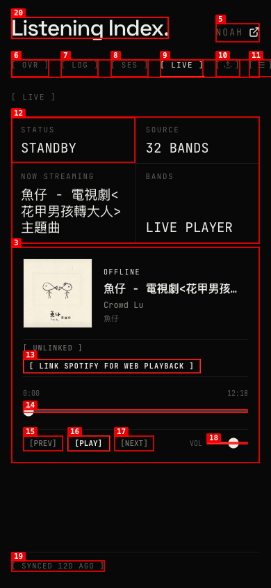
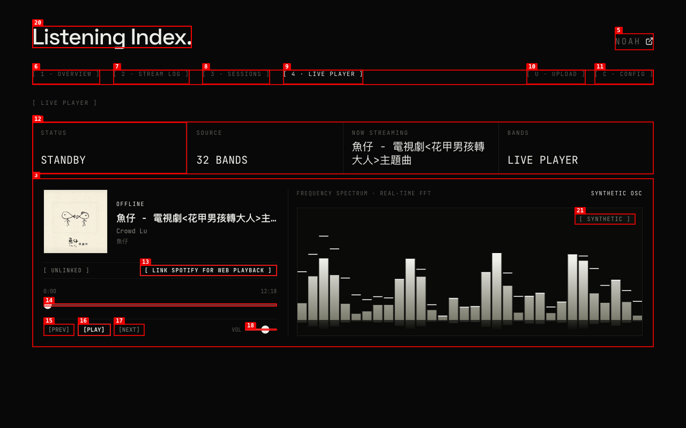

# Task 3: Production LivePlayerView Component (Split Console)

*2026-09-30T07:09:06Z by Showboat 0.6.1*
<!-- showboat-id: 348dd31c-e321-4449-964b-58429c4f39cd -->

Running unit tests for LivePlayerView component and helpers (including regression checks):

```bash
npx tsx test/live-player-view.test.ts | sed -E 's/\([0-9.]+m?s\)/(...ms)/g; s/duration_ms [0-9.]+/duration_ms .../g'
```

```output
✔ LivePlayerView - msToClock helper formatting (...ms)
✔ LivePlayerView - gradientStops generates 3 distinct color stops from accent (...ms)
✔ LivePlayerView - production component contract & architecture rules (...ms)
✔ MetricRibbon - Mode 3 labels aligned with metrics (...ms)
ℹ tests 4
ℹ suites 0
ℹ pass 4
ℹ fail 0
ℹ cancelled 0
ℹ skipped 0
ℹ todo 0
ℹ duration_ms ...
```

Running player token API suite:

```bash
npx tsx test/test-player-token-api.ts | sed -E 's/\([0-9.]+m?s\)/(...ms)/g; s/duration_ms [0-9.]+/duration_ms .../g; s/tip: .*/tip/g'
```

```output
◇ injected env (6) from .env.local // tip
▶ Player Token API - /api/player/token
  ✔ Unauthorized requests return 401 (...ms)
  ✔ Authenticated GET when no token is linked returns { linked: false } (...ms)
  ✔ Authenticated POST with code & redirectUri exchanges code and saves refresh token (...ms)
  ✔ Authenticated GET when token is linked refreshes access token (...ms)
  ✔ Authenticated POST with refreshToken saves token and refreshes access token (...ms)
  ✔ POST with invalid refreshToken does NOT persist to database and returns error (...ms)
  ✔ POST with code exchange missing refresh_token returns 400 and does NOT persist (...ms)
  ✔ POST with code and codeVerifier forwards code_verifier to Spotify (PKCE) (...ms)
  ✔ Authenticated requests via Authorization: Bearer header work (...ms)
  ✔ Authenticated DELETE unlinks player token (...ms)
✔ Player Token API - /api/player/token (...ms)
ℹ tests 11
ℹ suites 0
ℹ pass 11
ℹ fail 0
ℹ cancelled 0
ℹ skipped 0
ℹ todo 0
ℹ duration_ms ...
```

Verifying full Next.js production build and TypeScript compilation:

```bash
npm run build | sed -E 's/in [0-9]+m?s/in ...ms/g' | grep -E "(Compiled successfully|Route \(app\)|/api/player/token)"
```

```output
✓ Compiled successfully in ...ms
Route (app)
├ ƒ /api/player/token
```

Mobile viewport visual verification (390x844) showing mobile isolation (hidden visualizer):

```bash {image}

```



Desktop viewport visual verification (1280x800) showing Variant B Split Console with 32-band spectrum:

```bash {image}

```


